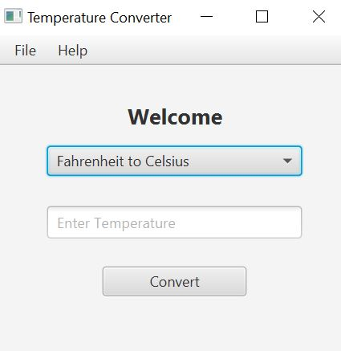
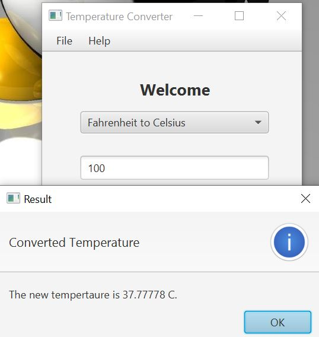

# TemperatureConverter
## My first Java Desktop Software Application.
It is simple Desktop Application that converts temperature in Celsius to Fahrenheit and vice versa. 

 

## Welcome
 

  
   
  

 

## Result
 

  
   
  

